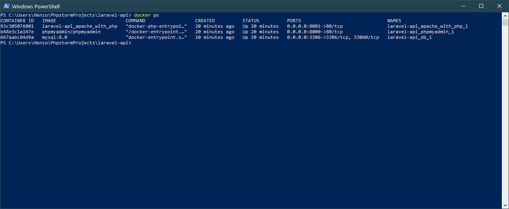

Setup
=====

Instale o [Docker](https://docs.docker.com/get-started/).

Abra o terminal na raiz da aplicação e digite o comando:
```sh
docker-compose up -d
```


Depois de concluído, o banco MYSQL já está criado e os comandos do artisan de `migrate` e `db:seed` já devem ter sido rodados automaticamente. A API já está pronta e pode ser acessada pela rota `http://localhost:8001/api/`

Para testar se está funcionando pode dar um `GET` na rota `/`:


Rotas
=====

```
GET|HEAD - api/login       - App\Http\Controllers\AuthController@login
DELETE   - api/delete/{id} - App\Http\Controllers\UserController@destroy
GET|HEAD - api/index       - App\Http\Controllers\UserController@index
GET|HEAD - api/me          - App\Http\Controllers\AuthController@me
POST     - api/store       - App\Http\Controllers\UserController@store
POST     - api/update/{id} - App\Http\Controllers\UserController@update
GET|HEAD - api/user/{id}   - App\Http\Controllers\UserController@show
```

- Antes de consumir a API é necessário logar chamando a rota de login com o usuário `henzo.gomes@gmail.com` senha `123` (esses dados estão parametrizados no `.env`)
- O login irá retornar um token que deve ser usado para autenticar as demais rotas.
- Também está disponível na pasta `postman` uma collection e um environment do Postman com todas as rotas. Essa collection já está pronta para adicionar automaticamente o token retornado pelo login em todas as requisições.


Teste da API
=====

Para rodar os testes, será necessário entrar no container do Docker para rodar o comando.

- Para listar os containers use o comando `docker ps`


- O nome do container é `laravel-api_apache_with_php_1`
- Pode ser acessado com o comando `docker exec -it laravel-api_apache_with_php_1 bash`

- Para rodar os testes, rode o comando `php artisan test`


DB
=====

Configuração do DB. User `admin` senha `1234`
